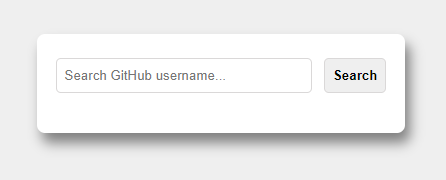
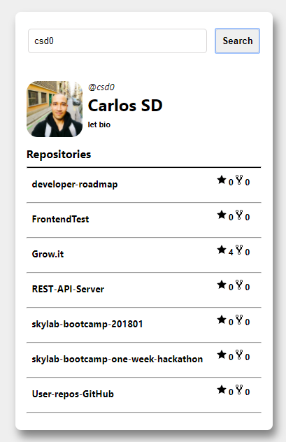
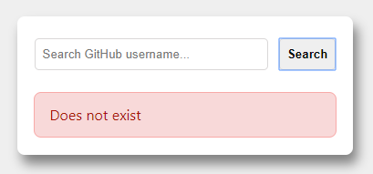
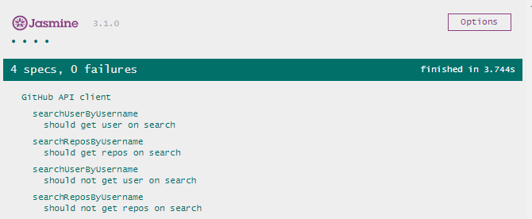

# User-repos-GitHub

## Target

Create a client side web application to search **GitHub** users and their associated repositories.

## Installation

As no frameworks nor packages are required, just download or clone the code and launch an http server of your choice. 
	
For example [live-server](https://www.npmjs.com/package/live-server).
	
Cd into the directory and execute:  
`live-server --port=1337`

## Functional description

### First Screen

The user can search a username of GitHub:

### Success Screen
If the searched username exists: The searched user profile is displayed with all their repositories:

### Error Screen

If the searched username does not exist: An error is shown:

## Technical description

- Application has been built using VanillaJS. 
- TDD tests completed with Jasmine 3.1.0.
- Data collected using GitHub API v3.

